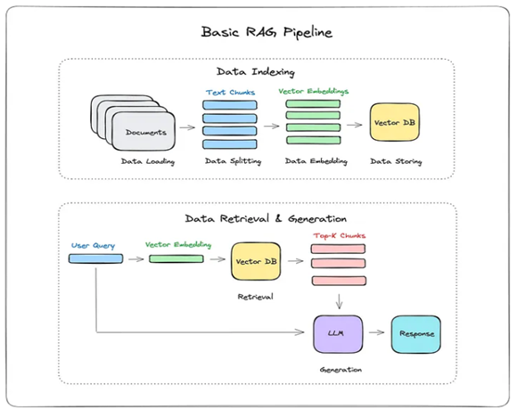

# Naive RAG System for Arabic Documents

## Overview

This project implements various RAG (Retrieval-Augmented Generation) systems with a focus on Arabic document processing. The current implementation features a Naive RAG approach,
which is the simplest yet effective version in the RAG ecosystem.

The system is built using:

* LangChain for RAG implementation
* Ollama (3.1 8B) as the local LLM
* FastAPI for backend services
* Streamlit for the user interface

## Naive RAG Work flow 
The Naive RAG system combines retrieval-based search with language model generation to provide accurate responses to user queries.

## Main Files Explanation

1) src/Nodes → this Folder has Files for each step of the Workflow e.g.(Chunking, loading, storing ...)
2) src/api → this Folder contains a FastAPi and Streamlit_app 
3) src/Controller.py → This file Calling the Nodes and passing the parameter to it.

## How It Works

### Initial Setup

1) Launch the FastAPI server and Streamlit interface 

2) System checks for existing vector store:
   * If none exists, initiates document processing pipeline
   * Convert documents to vectors
   * Stores embeddings in vector store

### Query Processing

1) User submits a query through Streamlit interface
2) System embeds the query
3) Retrieves relevant context from vector store
4) Generates response using Ollama LLM
5) Returns formatted response to user

## Notice

1) Remember to change the config
2) Use embedding from hugging Face I used (**intfloat/multilingual-e5-large**)
3) Use model from Ollama , I used (**llama3.1:8b-instruct-q4_0**)
4) In the Prompt you Should pass {Context} **Retrived Chunks** , Query **your question**

## Finally

feel free to Contact me for any questions or any comments: **ehabakram975@gmail.com**
